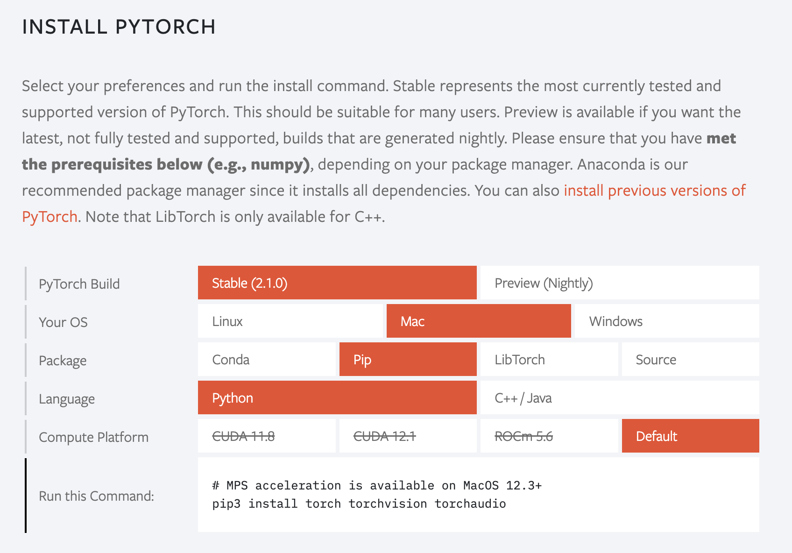

# macOS 版本安装教程

## 安装

详情请见官方网站：https://pytorch.org/



对于macOS版本的安装我们只需要打开终端，运行如下指令：

```bash
pip3 install torch torchvision torchaudio
```

## 验证

为了确保PyTorch是否安装成功，我们需要运行简单的样例代码测试GPU是否可以使用。

首先在命令行输入python，进入python的解释器，依次输入以下命令，每输入一句回车。

```python
import torch
x = torch.rand(5,3)
print(x)
```

输出的内容应该类似于以下：


```python
tensor([[0.3380, 0.3845, 0.3217],
        [0.8337, 0.9050, 0.2650],
        [0.2979, 0.7141, 0.9069],
        [0.1449, 0.1132, 0.1375],
        [0.4675, 0.3947, 0.1426]])
```