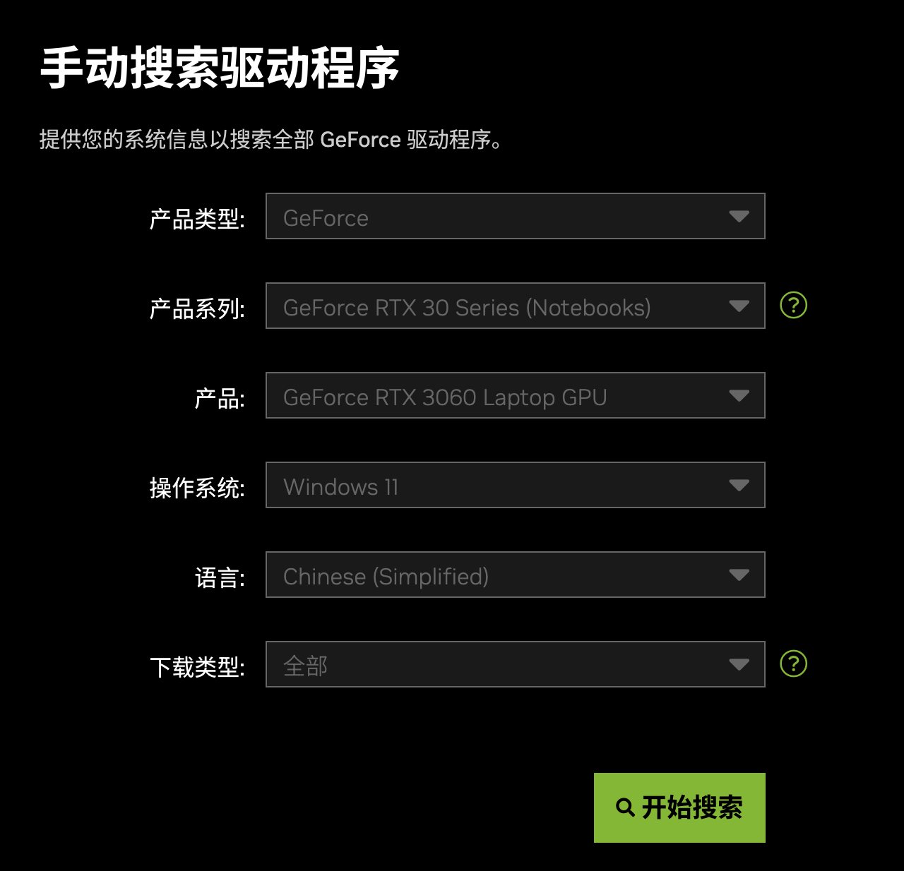
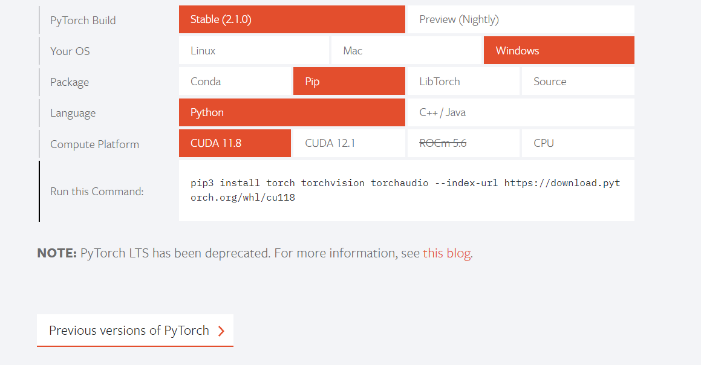
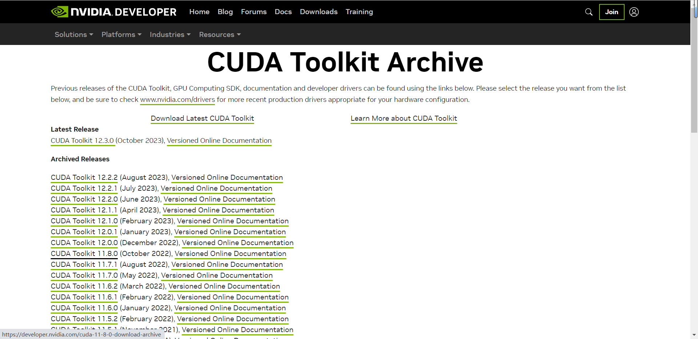
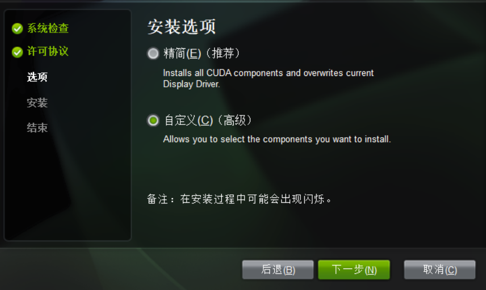
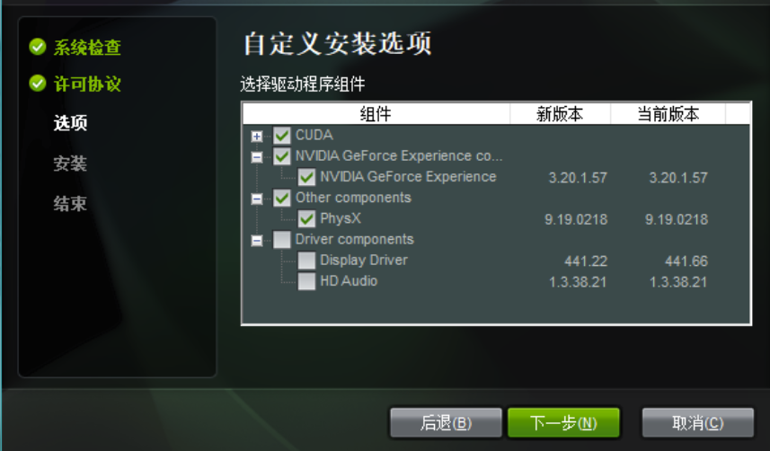
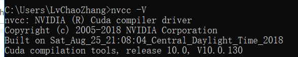
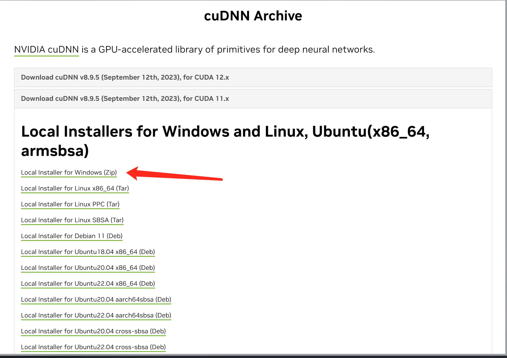
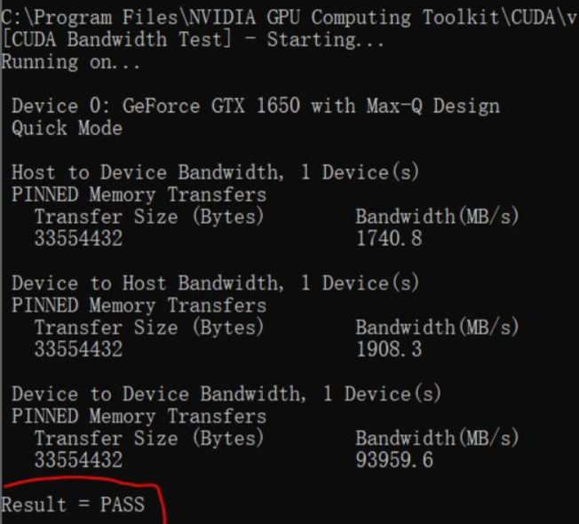

# Windows NVIDIA GPU 版本安装教程

我们强烈建议带有NVIDIA GPU的电脑安装GPU加速计算版本的Pytorch，AI模型训练速度会比纯CPU版本有惊人的提高。

:::tip

AMD GPU不支持此项加速，不要问我为什么不支持。简单一句NVIDIA的GPU垄断了整个AI的软件生态，只此一家别无分号。

:::

## CUDA 安装

### 1. 更新NVIDIA驱动

[驱动程序|GeForce](https://www.nvidia.cn/geforce/drivers/)



选择自己电脑显卡的型号（注意：笔记本的话选择型号后面带Notebooks的），下载最新的驱动安装包，点击下一步安装即可。

### 2. 找到合适的CUDA版本

结合[PyTorch的官方文档](https://pytorch.org/)来选择对应的CUDA版本。



我们以11.8版本为例。

### 2. CUDA 11.8 安装

1. 进入[CUDA官网](https://developer.nvidia.com/cuda-toolkit-archive)选择自己对应的版本，例如我们这里的CUDA Toolkit 11.8
   


2. 选择操作系统版本，安装方式选择"exe[local]"（本地安装），如下图，点击下载


安装过程中有两种安装选项，一个是精简安装，一个是自定义安装。
精简安装会安装CUDA相关组件，
同时也会将显卡驱动重新安装，如果不想重新安装显卡驱动，
可以选择自定义安装，这里选择自定义安装



之后选择需要安装的组件，这里将驱动组件取消，其他保持勾选



之后会让选择CUDA开发组件、文档、示例的安装位置，建议保持默认

安装完成CUDA，使用 Windows的终端命令行工具输入以下代码验证是否安装成功。

```bash
nvcc -V
```




### 3 cuDNN下载与安装

查看与自己的CUDA版本的适配版本：https://developer.nvidia.com/rdp/cudnn-archive
这里需要你注册一个NVIDIA的账号，然后进行问卷之后才可以进行下载页面，反正一步步操作即可。



下载得到一个压缩包，将cuDNN解压后得到的三个文件夹复制到cuda文件里面覆盖原有的这三个文件夹里的内容


加下来检验cuDNN安装是否是成功，在命令行中进入“ cuda安装的位置\CUDA\v11.8(视自己的版本而定)\extras\demo_suite ”，然后输入bandwidthTest.exe，得到Result = PASS则可视为cuDNN安装成功



## 安装PyTorch

### 1. pip安装

结合之前查看[PyTorch的官方文档](https://pytorch.org/)来选择对应的CUDA版本的页面，


我们可以得到如下命令，在Windows命令行中输入便可安装对应的Pytorch GPU版本。

```bash
pip3 install torch torchvision torchaudio --index-url https://download.pytorch.org/whl/cu118
```

:::danger
此处Pytorch CUDA的安装命令请参照Pytorch官方文档，本教程中的命令只是适用CUDA 11.8版本。
:::

### 2. 安装验证

为了确保PyTorch是否安装成功，我们需要运行简单的样例代码测试GPU是否可以使用。

首先在命令行输入python，进入python的解释器，依次输入以下命令，每输入一句回车。

```python
import torch
torch.cuda.is_available()
```
如果输出“True”，则说明NVIDIA GPU版本的Pytorch安装成功。